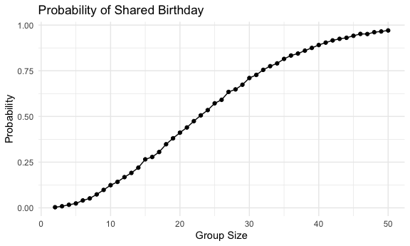
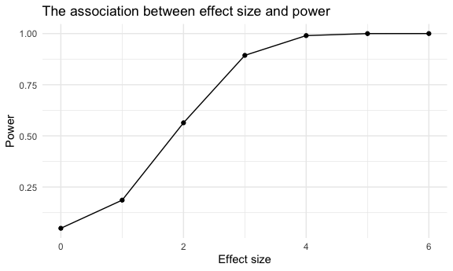
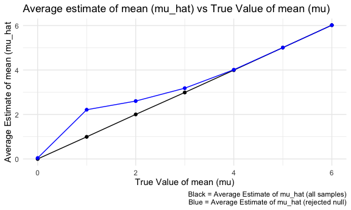
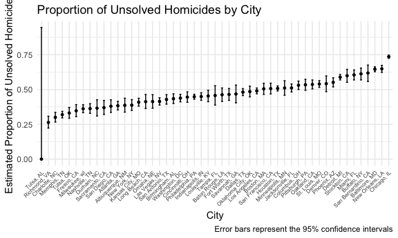
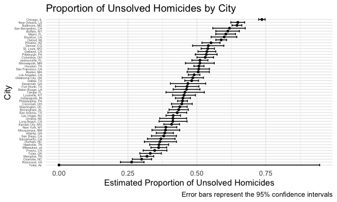

p8105_mtp_ml5218
================
Muying Li
2025-11-11

``` r
# Load necessary packages and set plot theme 
library(tidyverse)
```

    ## ── Attaching core tidyverse packages ──────────────────────── tidyverse 2.0.0 ──
    ## ✔ dplyr     1.1.4     ✔ readr     2.1.5
    ## ✔ forcats   1.0.0     ✔ stringr   1.5.1
    ## ✔ ggplot2   3.5.2     ✔ tibble    3.3.0
    ## ✔ lubridate 1.9.4     ✔ tidyr     1.3.1
    ## ✔ purrr     1.1.0     
    ## ── Conflicts ────────────────────────────────────────── tidyverse_conflicts() ──
    ## ✖ dplyr::filter() masks stats::filter()
    ## ✖ dplyr::lag()    masks stats::lag()
    ## ℹ Use the conflicted package (<http://conflicted.r-lib.org/>) to force all conflicts to become errors

``` r
#library(patchwork)
#library(dplyr)
# library(rvest)
knitr::opts_chunk$set(
  fig.path = "figs/",
  fig.width = 6,
  fig.asp = .6,
  out.width = "90%"
)

theme_set(theme_minimal() + theme(legend.position = "bottom"))

options(
  ggplot2.continuous.colour = "viridis",
  ggplot2.continuous.fill = "viridis"
)

scale_colour_discrete = scale_colour_viridis_d
scale_fill_discrete = scale_fill_viridis_d
```

# Problem 1

``` r
bday_sim = function(n){
  bday = sample(1:365, n, replace=TRUE)
  repeated_bday = length(unique(bday))<n
  repeated_bday
}

bday_sim_results = 
  expand_grid(
    # group size 2-50
    group_size = 2:50,
    # simulate for 10000x
    iter = 1:10000
  ) |> 
  mutate(
    result = map_lgl(group_size, bday_sim)
  ) |> 
  group_by(
    group_size
  ) |> 
  summarize(
    prob_repeat = mean(result)
  )
# plot
bday_sim_results |> 
  ggplot(aes(x=group_size, y=prob_repeat)) +
  geom_point()+
  geom_line()+
  labs(title = "Probability of Shared Birthday",
       x = "Group Size",
       y = "Probability")
```



From the line plot above, we can see that the probability of at least
two people sharing a birthday increases non-linearly as the group size
grows. As the group size increases beyond around 20, the probability
starts rising quite sharply. As the group size nears 50, the probability
approaches 1, which means with about 50 people in the room, it’s nearly
certain that at least two people will share a birthday.

# Problem 2

``` r
n = 30
sigma = 5
mu = 0
num_sim = 5000
set.seed(1)
# generate 5000 datasets from the normal model
simulate_t_test <- function(mu, n = 30, sigma = 5, num_sim = 5000, alpha = 0.05) {
  results =
    expand_grid(iter = 1:num_sim) |> 
    mutate(
      data = map(iter, ~rnorm(n, mean = mu, sd = sigma)),  
      t_test = map(data, ~t.test(.x, mu = 0)),
      t_test_result = map(t_test, broom::tidy),
    ) |> 
    unnest(t_test_result) |> 
    mutate(
      true_mu = mu,
      mu_hat = estimate,
      p_value = p.value,
      rejected = p_value < alpha
    ) |> 
    select(iter, true_mu, mu_hat, p_value, rejected) 
  results
}

# set mu=0
# simulate_t_test(0)

# repeat for mu={1,2,3,4,5,6}
mu <- c(0, 1, 2, 3, 4, 5, 6)
simulate_t_tests <- map_dfr(mu, ~simulate_t_test(mu = .x))

power <- 
  simulate_t_tests |> 
  group_by(true_mu) |> 
  summarize(
    power = mean(rejected)
  )

# plot
ggplot(power, aes(x = mu, y = power)) +
  geom_point() +
  geom_line() +
  labs(
    title = "The association between effect size and power",
    x = "Effect size",
    y = "Power"
  )
```



From the plot above, we can tell that the association between effect
size and power positive. As the effect size increases, the power of the
test increases. Give the `alpha=0.05`, the power reaches about 1 as the
effect size increases to 4 and above.

``` r
simulate_t_tests |>
  group_by(true_mu) |>
  summarize(
    avg_mu_hat = mean(mu_hat),
    avg_rejected_mu_hat = mean(mu_hat[rejected])
  ) |> 
  ggplot(aes(x = true_mu)) +
  geom_point(aes(y = avg_mu_hat)) +
  geom_line(aes(y = avg_mu_hat)) +
  geom_point(aes(y = avg_rejected_mu_hat), color = "blue") +
  geom_line(aes(y = avg_rejected_mu_hat), color = "blue") +
  labs(
    title = "Average estimate of mean (mu_hat) vs True Value of mean (mu)",
    x = "True Value of mean (mu)",
    y = "Average Estimate of mean (mu_hat",
    caption = "Black = Average Estimate of mu_hat (all samples)\nBlue = Average Estimate of mu_hat (rejected null)"
  )
```



Based on the plot above, the sample average of $\hat\mu$ across tests
for which the null is rejected is approximately equal to the true value
of $\mu$, especially as the true value of $\mu$ increases. This is
because when the null hypothesis is rejected, it indicates a significant
difference between the sample mean and the null hypothesis mean and
there is enough evidence that the sample mean is not close to 0. This
suggests that the sample mean tends to be closer to the true population
mean $\mu$. The larger $\mu$, larger effect size, which is easier to
detect, resulting in a sample mean estimate that is more accurate.

# Problem 3

``` r
# load data and clean names
data = read_csv("data/homicide-data.csv") |>
  janitor::clean_names()
```

    ## Rows: 52179 Columns: 12
    ## ── Column specification ────────────────────────────────────────────────────────
    ## Delimiter: ","
    ## chr (9): uid, victim_last, victim_first, victim_race, victim_age, victim_sex...
    ## dbl (3): reported_date, lat, lon
    ## 
    ## ℹ Use `spec()` to retrieve the full column specification for this data.
    ## ℹ Specify the column types or set `show_col_types = FALSE` to quiet this message.

``` r
head(data, 10)
```

    ## # A tibble: 10 × 12
    ##    uid        reported_date victim_last  victim_first victim_race victim_age
    ##    <chr>              <dbl> <chr>        <chr>        <chr>       <chr>     
    ##  1 Alb-000001      20100504 GARCIA       JUAN         Hispanic    78        
    ##  2 Alb-000002      20100216 MONTOYA      CAMERON      Hispanic    17        
    ##  3 Alb-000003      20100601 SATTERFIELD  VIVIANA      White       15        
    ##  4 Alb-000004      20100101 MENDIOLA     CARLOS       Hispanic    32        
    ##  5 Alb-000005      20100102 MULA         VIVIAN       White       72        
    ##  6 Alb-000006      20100126 BOOK         GERALDINE    White       91        
    ##  7 Alb-000007      20100127 MALDONADO    DAVID        Hispanic    52        
    ##  8 Alb-000008      20100127 MALDONADO    CONNIE       Hispanic    52        
    ##  9 Alb-000009      20100130 MARTIN-LEYVA GUSTAVO      White       56        
    ## 10 Alb-000010      20100210 HERRERA      ISRAEL       Hispanic    43        
    ## # ℹ 6 more variables: victim_sex <chr>, city <chr>, state <chr>, lat <dbl>,
    ## #   lon <dbl>, disposition <chr>

## Dataset Description

The data was collected by the Washington Post on 52179 criminal
homicides over the past decade in 50 of the largest American cities. It
contains 12 variables:

- `uid`: the unique identifier of each homicide case
- `reported_data`: date when the violent crime was reported
- basic demographic information about the victim: `victim_last`
  (victim’s last name), `victim_first` (victim’s first name),
  `victim_race`, `victim_age`, `victim_sex`
- location of the killing related data: `city`, `state`, `lat` and `lon`
  (latitude and longitude)
- `disposition`: indication of whether an arrest was made

## Estimation of the proportion of unsolved homicides in Baltimore, MD

``` r
homicide_summary <- 
  data |> 
  # Create a city_state variable (e.g. “Baltimore, MD”) 
  mutate(
    city_state = paste(str_trim(city), str_trim(state), sep = ", "),
  ) |>
  # summarize within cities to obtain the total number of homicides and the number of unsolved homicides (those for which the disposition is “Closed without arrest” or “Open/No arrest”).
  group_by(city_state) |>
  summarize(
    total = n(),
    unsolved = sum(tolower(str_trim(disposition)) %in% c("closed without arrest", "open/no arrest")),
  )
  
# For the city of Baltimore, MD, use the prop.test function to estimate the proportion of homicides that are unsolved
baltimore_data <- 
  homicide_summary |> 
  filter(
    city_state == "Baltimore, MD"
  ) 
# save the output of prop.test as an R object
baltimore_prop <-
  prop.test(
    x = pull(baltimore_data,unsolved),
    n = pull(baltimore_data,total)
  ) 
# apply the broom::tidy to this object
baltimore_prop |> 
  broom::tidy() |> 
  # pull the estimated proportion and confidence intervals from the resulting tidy dataframe
  select(
    estimate,
    conf.low,
    conf.high
  )
```

    ## # A tibble: 1 × 3
    ##   estimate conf.low conf.high
    ##      <dbl>    <dbl>     <dbl>
    ## 1    0.646    0.628     0.663

## Estimation of the proportion of unsolved homicides for all cities

``` r
prop_test <- function(unsolved, total) {
  test_result <- prop.test(x = unsolved, n = total)
  broom::tidy(test_result) |>
    select(estimate, conf.low, conf.high)
}

props <- 
  homicide_summary |>
  # run prop.test for each of the cities in your dataset, and extract both the proportion of unsolved homicides and the confidence interval for each.
  mutate(
    results = map2(
      .x = unsolved, 
      .y = total,    
      .f = prop_test
    )
  ) |>
  #  list columns and unnest as necessary to create a tidy dataframe with estimated proportions and CIs for each city.
  unnest(results) 
```

    ## Warning: There was 1 warning in `mutate()`.
    ## ℹ In argument: `results = map2(.x = unsolved, .y = total, .f = prop_test)`.
    ## Caused by warning in `prop.test()`:
    ## ! Chi-squared approximation may be incorrect

``` r
props
```

    ## # A tibble: 51 × 6
    ##    city_state      total unsolved estimate conf.low conf.high
    ##    <chr>           <int>    <int>    <dbl>    <dbl>     <dbl>
    ##  1 Albuquerque, NM   378      146    0.386    0.337     0.438
    ##  2 Atlanta, GA       973      373    0.383    0.353     0.415
    ##  3 Baltimore, MD    2827     1825    0.646    0.628     0.663
    ##  4 Baton Rouge, LA   424      196    0.462    0.414     0.511
    ##  5 Birmingham, AL    800      347    0.434    0.399     0.469
    ##  6 Boston, MA        614      310    0.505    0.465     0.545
    ##  7 Buffalo, NY       521      319    0.612    0.569     0.654
    ##  8 Charlotte, NC     687      206    0.300    0.266     0.336
    ##  9 Chicago, IL      5535     4073    0.736    0.724     0.747
    ## 10 Cincinnati, OH    694      309    0.445    0.408     0.483
    ## # ℹ 41 more rows

### Visualization of the estimates and CIs

``` r
# Create a plot that shows the estimates and CIs for each city

props |> 
  mutate(
    # Organize cities according to the proportion of unsolved homicides.
    city_state = reorder(city_state, estimate)
  ) |> 
  ggplot(aes(x = city_state, y = estimate)) +
  geom_point(size = 1) + 
  # add geom_errorbar for a way to add error bars based on the upper and lower limits
  geom_errorbar(
    aes(ymin = conf.low, ymax = conf.high), 
    width = 0.3,  
  ) +
  labs(
    title = "Proportion of Unsolved Homicides by City",
    x = "City",
    y = "Estimated Proportion of Unsolved Homicides",
    caption = "Error bars represent the 95% confidence intervals"
  ) +
  theme(
    # rotate and adjust size of x-axis labels
    axis.text.x = element_text(angle = 45, hjust = 1, size = 6)
  )
```



Flip the axises for better view:

``` r
props |> 
  mutate(
    # Organize cities according to the proportion of unsolved homicides.
    city_state = reorder(city_state, estimate)
  ) |> 
  ggplot(aes(x = city_state, y = estimate)) +
  geom_point(size = 1) + 
  # add geom_errorbar for a way to add error bars based on the upper and lower limits
  geom_errorbar(
    aes(ymin = conf.low, ymax = conf.high), 
    width = 0.8,  
  ) +
  labs(
    title = "Proportion of Unsolved Homicides by City",
    x = "City",
    y = "Estimated Proportion of Unsolved Homicides",
    caption = "Error bars represent the 95% confidence intervals"
  ) +
  coord_flip()+
  theme(
    # rotate and adjust size of x-axis labels
    axis.text.y = element_text(size = 4)
  )
```


